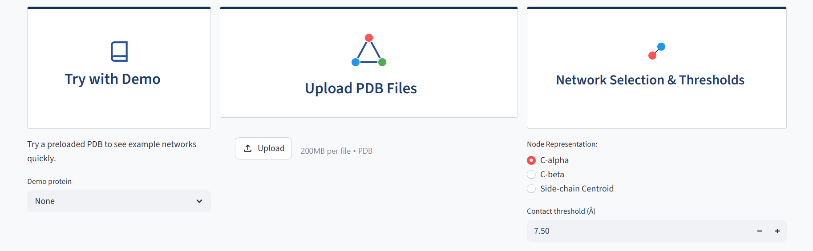
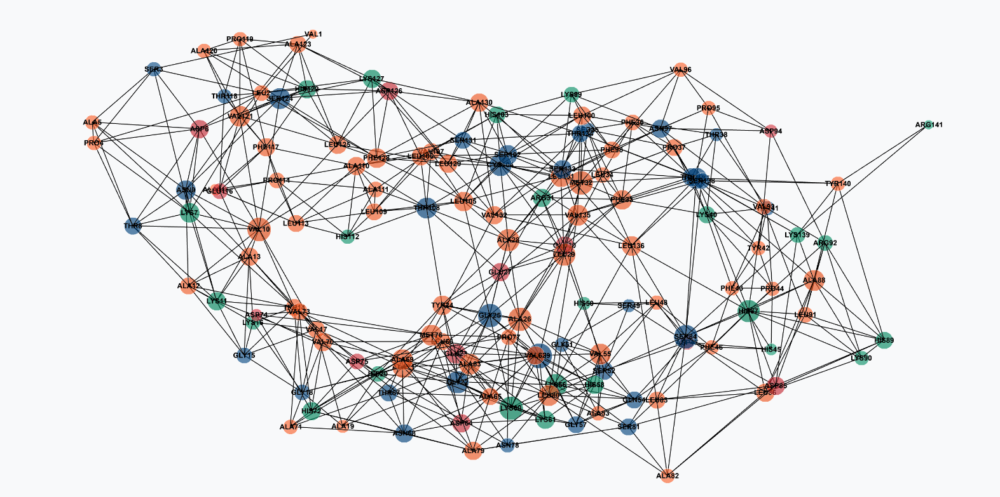
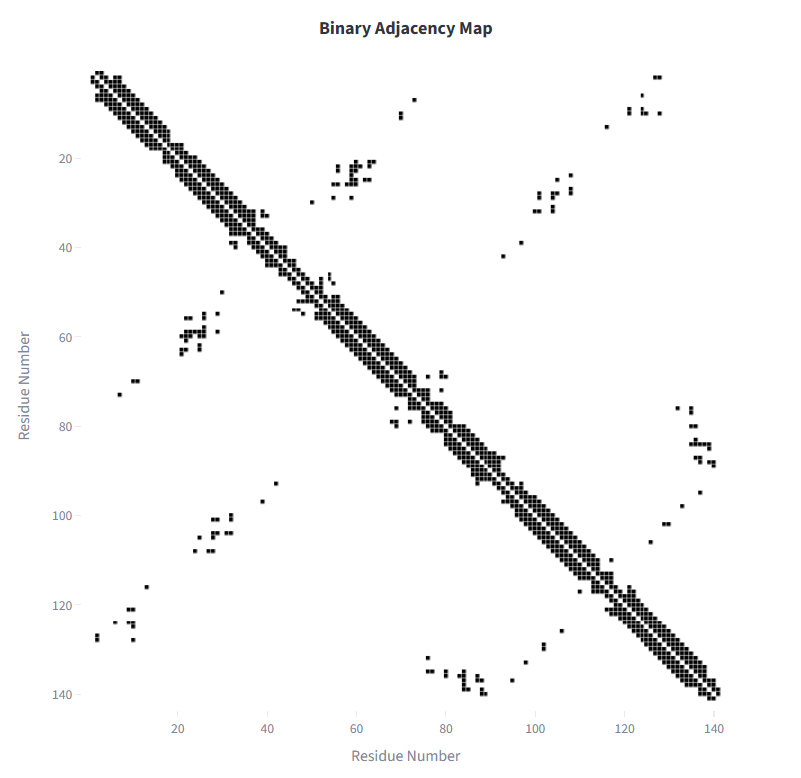
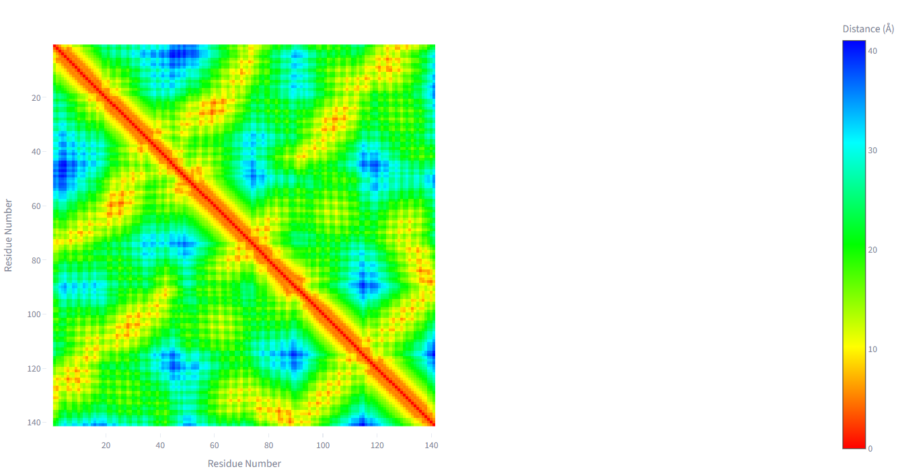
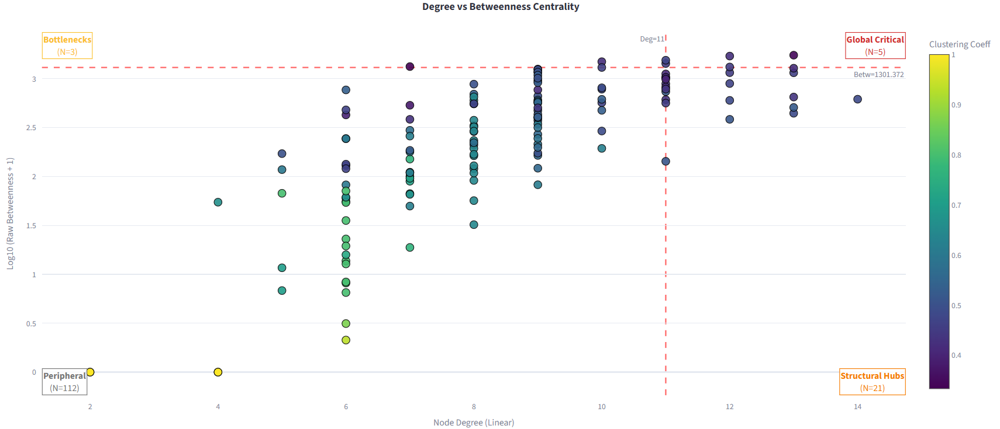
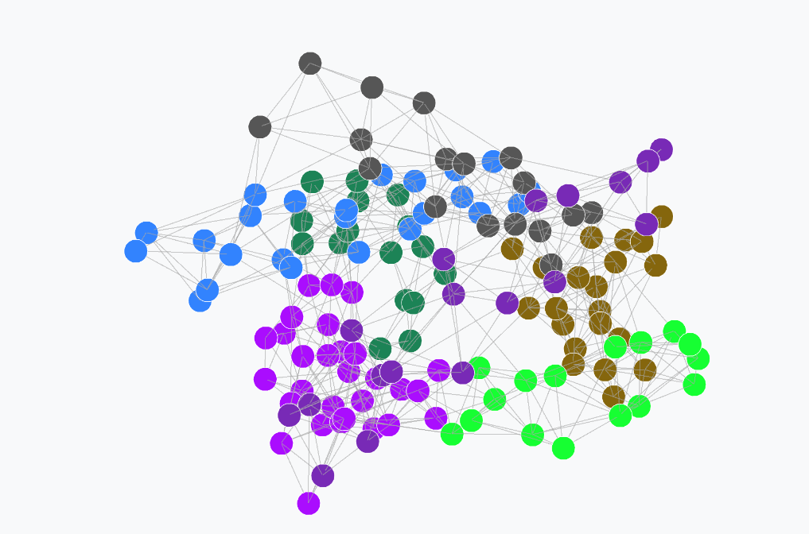
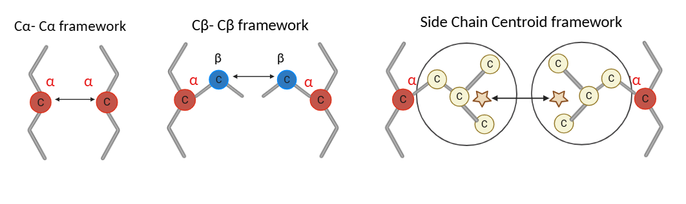

# Protein Contact Network Explorer (PCNE)


PCNE (Protein Contact Network Explorer) is an interactive web-based tool for 
constructing, visualising, and analysing Protein Contact Networks derived from 
PDB structure files. It supports three node representation modes which are  Cα, Cβ, and 
Side-chain Centroid and computes key 
topological metrics including node degree, clustering coefficient, and betweenness 
centrality with z-score based classification of residues into Peripheral, Structural 
Hub, Bottleneck, and Global Critical Hub categories. Community detection is 
implemented via the Leiden algorithm with per-community DSSP secondary structure 
composition reporting. Visualisations include an interactive 2D contact network, 
adjacency and distance heatmaps, and an embedded 3D NGL Viewer with a toggle 
between betweenness centrality gradient and community membership colouring. 
Networks can be exported in SIF format for downstream Cytoscape integration.

🔗 **Live Application:** https://lactdr5rfibhg9m5tmamwg.streamlit.app/

---

## Table of Contents

- [Screenshots](#screenshots)
- [Features](#features)
- [Methodology](#methodology)
- [Installation](#installation)
- [Usage](#usage)
- [Citation](#citation)
- [Acknowledgements](#acknowledgements)

---

## Screenshots

<table>
  <tr>
    <td></td>
    <td></td>
  </tr>
  <tr>
    <td align="center"><b>Input panel with node representation selector</b></td>
    <td align="center"><b>Full 2D contact network</b></td>
  </tr>
  <tr>
    <td></td>
    <td></td>
  </tr>
  <tr>
    <td align="center"><b>Binary adjacency map</b></td>
    <td align="center"><b>Pairwise distance heatmap</b></td>
  </tr>
  <tr>
    <td></td>
    <td></td>
  </tr>
  <tr>
    <td align="center"><b>Degree vs betweenness centrality 
    classification</b></td>
    <td align="center"><b>Leiden community detection with DSSP 
    composition</b></td>
  </tr>
  <tr>
    <td></td>
    <td></td>
  </tr>
  <tr>
    <td align="center"><b>3D structure coloured by betweenness 
    centrality</b></td>
    <td align="center"><b>3D structure coloured by community 
    membership</b></td>
  </tr>
</table>

---

## Features

- **Network Construction** — accepts PDB files from X-ray crystallography and 
NMR ensembles with three node representation modes: Cα, Cβ, and Side-chain 
Centroid, each with calibrated default cutoffs.
- **Topological Metrics** — computes node degree, local clustering coefficient, 
Wasserman-Faust normalised closeness centrality, and betweenness centrality with 
z-score based classification into four functional residue categories.
- **Community Detection** — Leiden algorithm with modularity Q reporting and 
per-community DSSP secondary structure composition breakdown
- **3D Visualisation** — embedded NGL Viewer with toggle between betweenness 
centrality gradient colouring and Leiden community membership colouring
- **Interactive 2D Network** — multiple filtering modes including hub view, 
hydrophobic core, closeness centrality, and betweenness views with biochemical 
residue type colouring
- **Export** — SIF format export for Cytoscape integration and matrix downloads

---

## Methodology

### Network Construction

Each residue is represented as a node. Edges are defined by Euclidean distance 
between residue coordinate representations. A binary adjacency matrix is 
constructed using a user-defined cutoff rc:

$$d(i,j) = \sqrt{(x_i - x_j)^2 + (y_i - y_j)^2 + (z_i - z_j)^2}$$

$$A(i,j) = \begin{cases} 1 & d(i,j) \leq r_c \\ 0 & d(i,j) > r_c \end{cases}$$

PCNE supports three node representation modes. The figure below illustrates how 
the measured inter-residue distance differs across representations:

<p align="center">
  
</p>
<p align="center">
  <em>Figure 1: Node representation modes. Cα uses the alpha carbon, Cβ uses 
  the beta carbon, and Side-chain Centroid uses the mean position of all 
  non-hydrogen side-chain heavy atoms. Distance is measured between the 
  respective reference points of neighbouring residues.</em>
</p>

For the Side-chain Centroid mode, the centroid position is computed as:

$$\vec{r}_i^{\,SC} = \frac{1}{N_i} \sum_{k=1}^{N_i} \vec{r}_{i,k}$$

where $N_i$ is the number of side-chain heavy atoms and $\vec{r}_{i,k}$ is the 
coordinate vector of the k-th heavy atom. Glycine, which has no side-chain heavy 
atoms, falls back to its Cα position.

---

### Topological Metrics

PCNE computes four graph-theoretic metrics per residue: degree (number of 
contacts), local clustering coefficient (local cohesiveness), Wasserman-Faust 
normalised closeness centrality (global reachability), and betweenness centrality 
(information flow bottleneck score).

$$C_{between}(i) = \sum_{s \neq i \neq t} \frac{\sigma_{st}(i)}{\sigma_{st}}$$

Residues are classified into four functional categories using z-score thresholds 
applied jointly to degree and betweenness distributions:

| Category | Degree | Betweenness |
|---|---|---|
| Global Critical Hub | High | High |
| Structural Hub | High | Low |
| Bottleneck | Low | High |
| Peripheral | Low | Low |

<p align="center">
  
</p>
<p align="center">
  <em>Figure 2: Residue classification by degree and betweenness centrality 
  into four functional roles.</em>
</p>

---

### Community Detection

Community structure is identified using the Leiden algorithm optimising 
modularity Q. Partition quality is reported as modularity Q directly within 
the interface.

$$Q = \frac{1}{2m} \sum_{i,j} \left[ A_{ij} - \frac{k_i k_j}{2m} \right] 
\delta(c_i, c_j)$$

Each community's biological relevance is assessed through per-community DSSP 
secondary structure composition, reporting the fraction of helix (H), strand 
(E), and coil (C) residues per cluster.

<p align="center">
  
</p>
<p align="center">
  <em>Figure 3: Leiden community detection with per-community secondary 
  structure composition bars.</em>
</p>

---

### 3D Visualisation

The embedded NGL Viewer renders the protein backbone in cartoon representation 
coloured either by log-normalised betweenness centrality using a coolwarm 
gradient, or by Leiden community membership using a consistent qualitative 
colour palette.

$$c_i^{\text{norm}} = \frac{\log(1 + BC_i) - \log(1 + BC_{\min})}
{\log(1 + BC_{\max}) - \log(1 + BC_{\min})}$$

<table>
  <tr>
    <td></td>
    <td></td>
  </tr>
  <tr>
    <td align="center"><em>Betweenness centrality gradient</em></td>
    <td align="center"><em>Leiden community membership</em></td>
  </tr>
</table>

*Figure 4: 3D structure viewer with toggle between centrality and community 
colouring.*

---

## Installation

```bash
git clone https://github.com/yourrepo/pcne
cd pcne
pip install -r requirements.txt
streamlit run app.py
```

### Requirements
* `streamlit`
* `biopython`
* `networkx`
* `numpy`
* `scipy`
* `pandas`
* `plotly`
* `leidenalg`
* `igraph`
* `scikit-learn`
* `pillow`
---

## Usage

1. Upload a PDB file or select a demo protein from the provided list
2. Select node representation (Cα, Cβ, or Side-chain Centroid) and set the 
contact distance threshold
3. Explore the network views, community detection, 3D structure viewer, and 
export results in SIF format for Cytoscape

---

## Citation

If you use PCNE in your research, please cite:

```bibtex
@article{ganapathy2026pcne,
  title   = {Protein Contact Network Explorer: Topological Analysis 
             of Protein Structures},
  author  = {Ganapathy, Akhurath and Krishnan, Sanjana V 
             and Emerson, Arnold},
  journal = {Frontiers in Bioinformatics},
  year    = {2026}
}
```

---

## Acknowledgements

The authors thank Vellore Institute of Technology (VIT), Vellore, for providing 
the infrastructure to support this work.


